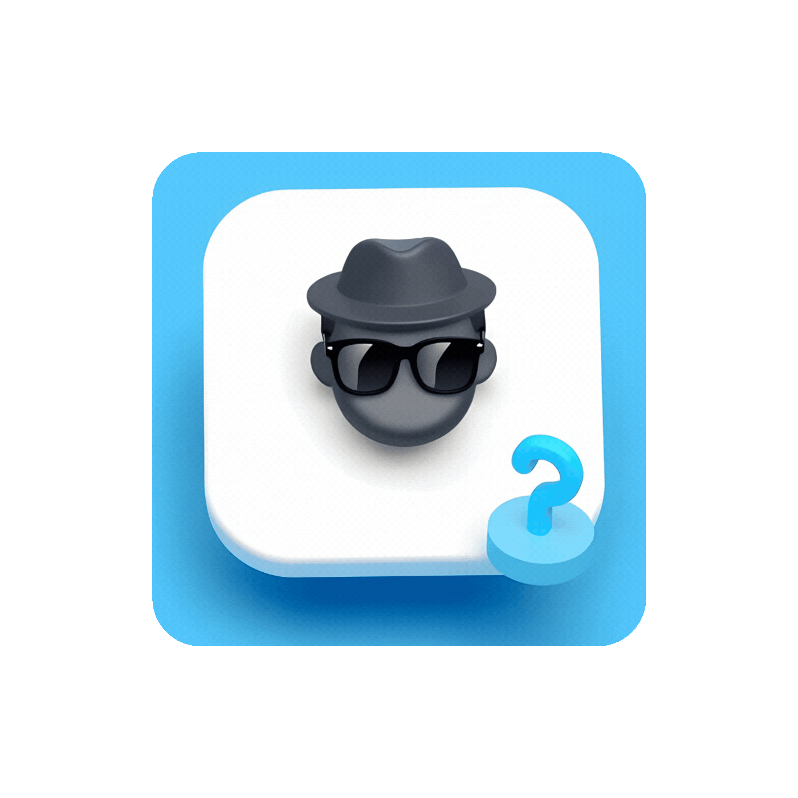

# YesYouCanQuiz — Allow Visitors & Guests to Take Quizzes

## Overview

YesYouCanQuiz is a Moodle local plugin that enables **unauthenticated visitors** to take quizzes by automatically logging them in as a designated "public" user. 

By bypassing Moodle’s default guest restrictions on quiz attempts, this plugin allows you to:

- **Initiate New Quiz Attempts**: Visitors can start a new quiz attempt each time they access a quiz.
- **Centralized Tracking**: All quiz attempts are recorded under a single "public" user, facilitating monitoring and analysis of quiz activity.

## Features

- **Seamless Public Login**: Unauthenticated visitors are temporarily logged in as the public user when they click on a quiz link.
- **Fresh Quiz Attempts**: Each time a visitor accesses a quiz view page, any unfinished attempts are closed (or bypassed), ensuring a new attempt is initiated and preventing resumption of old attempts.
- **Automatic Session Handling**: The selected public user is active only within the quiz area and is automatically logged out when visitors leave.
- **Accurate Centralized Tracking**: All visitor quiz attempts are registered under the public user, allowing for comprehensive tracking of quiz activity.

## Installation

1. **Download the Plugin**: Download the YesYouCanQuiz plugin ZIP file.
2. **Access Plugin Installation**: In your Moodle site, navigate to `Site Administration → Plugins → Install plugins`.
3. **Upload and Install**: Upload the ZIP file and follow the on-screen instructions to complete the installation.

## Setup Instructions

1. **Configure the Plugin**: Navigate to `Site Administration → Plugins → Local Plugins → YesYouCanQuiz`.
2. **Select the Public User**:
   - A dropdown list will display your manual accounts. Select the one you wish to use as the "public" user.

> [!WARNING]
> Do **not** select the default guest account. Moodle does not detect the default guest account >for quiz attempt bypass, so it will not work.

3. **Save Changes and Test**: Save your settings and test the plugin by accessing a quiz as an unauthenticated user. Every attempt will be recorded under the public user account.

> [!TIP]
> Create a dedicated role (e.g., "Quiz Only") that grants only the permissions to view and attempt >quizzes, and assign that role to your "public" user.

## Configuration & Recommendations

- **Dedicated Role for Public User**: It is essential to create a custom role with a minimal set of capabilities—only those necessary for viewing and attempting quizzes. Avoid granting additional privileges such as dashboard access, profile editing, or self-enrollment. This approach secures your site and ensures that only quiz-related functionalities are accessible to visitors.
- **Tracking Attempts**: All quiz attempts made by visitors will be registered under the public user account. While this allows you to track quiz activity, data will be consolidated under that single account.
- **Security Notice**: Misconfiguring the public user (by assigning it a role with excessive privileges) may expose sensitive site functions. Please configure the public user's role with extreme caution.

> [!CAUTION]
> **It is strongly advised to create a dedicated role with only the necessary capabilities to view and attempt quizzes and assign that role to the public user account**. The default guest account is not supported by this plugin, and configuring the public user with excessive privileges may compromise your site's security. The author and contributors of YesYouCanQuiz assume no liability for any issues arising from incorrect role configuration or misconfiguration of the public user account.

## Version & Author

- **Version**: 1.1
- **Author**: [@ikramagix](https://ikramagix.com)

## Support

For support, feedback, or further information, please contact me at [hello@ikramagix.com](mailto:hello@ikramagix.com) or refer to the Moodle community forums.